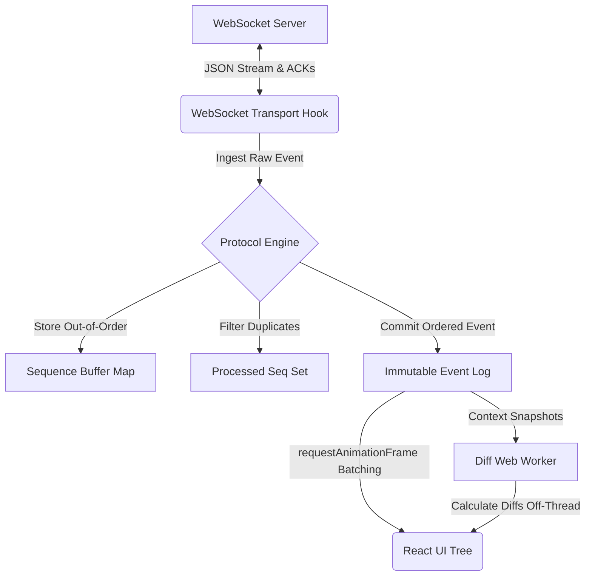

# Deterministic AI Observability Console

A production-grade, event-sourced telemetry dashboard designed to monitor and control a streaming AI agent. The console handles unstable network channels by processing all socket payloads through a deterministic protocol engine, projecting all visual states strictly from an immutable event log.

---

## System Architecture



---

## Directory Structure
*   `/agent-console`: Next.js 14 frontend console (TypeScript, Vanilla CSS, Neobrutalist design).
*   `/agent-server`: Mock AI agent server (TypeScript, tsx runtime).

---

## Core Engineering Highlights

*   **100% Deterministic State Projection**: UI components run the immutable event log chronologically to derive state. The transport layer has no state-modification side effects, guaranteeing zero view drift.
*   **Sequence-Based Reordering**: Buffers out-of-order packets (`seq > expected`) in a hash map and processes them recursively once missing packets arrive, maintaining chronological order.
*   **Deduplication**: Drops duplicate sequence numbers in $O(1)$ time using a tracking set to prevent double-rendering.
*   **Auto-Recovery & RESUME Handshake**: Handles unexpected connection drops by initiating a handshake with the last committed sequence number. The server replays missed packets, and the client filters them against its processed log.
*   **Off-Thread Web Worker Diffing**: Isolates heavy structural object diff calculations (on 500KB+ database schemas) to a Web Worker, preserving a constant 60 FPS on the main UI thread.
*   **rAF-Batched Rendering**: Batches high-frequency token updates inside `requestAnimationFrame` hooks to prevent browser layout thrashing and reflow bottlenecks.
*   **Trace Focus-Linking**: Maps timeline logs to chat cards, letting users click on any chat message to highlight corresponding execution traces instantly.
*   **Stale Socket Rejection**: Rejects callbacks from stale sockets during hot-reloads by tracking the active socket reference pointer.

---

## Quick Start

### 1. Start the Server (Port `4747`)
```bash
cd agent-server
npm install
npm run dev

# Or with Docker:
docker build -t agent-server .
docker run -p 4747:4747 agent-server
```

### 2. Start the Console (Port `3000`/`3001`)
```bash
cd agent-console
npm install
npm run dev
```

### 3. Run the Test Suite
```bash
cd agent-console
npm run test
```

---
## Demo Video
[Watch the project demo on YouTube](https://youtu.be/Pgg1K6MVOAI)

---

## Technical Design Decisions

### Packet Reordering & Deduplication
To handle unstable channels that shuffle or repeat packets:
*   **O(1) Sequence Buffer**: Out-of-order frames (`seq > expected_seq`) are held in a key-value map.
*   **Linear Commit Loop**: Upon receiving the expected sequence number, the client commits it and recursively checks the buffer for `expected_seq + 1` to resolve gaps.
*   **Double-Render Prevention**: A sequence set tracks all committed sequence numbers. Any packet whose sequence number is already present is immediately discarded.

### RESUME Handshake Recovery
To recover state after connection drops without repeating the entire conversation:
*   The client sends a `RESUME` frame containing the `last_committed_seq`.
*   The server replays only the sequence numbers following that ID.
*   Any overlap is resolved by the client's deduplication set, resuming the live stream seamlessly.

### Layout Reflow Mitigation
High-throughput token streams frequently trigger browser repaint bottlenecking:
*   **Block Partitioning**: Tokens are grouped into static `text` and `tool` block nodes.
*   **State Freezing**: When a tool call starts, the text block reference is frozen to prevent layout shifts.
*   **Append-on-Resume**: Resuming tokens start a new block below the tool card, leaving preceding nodes untouched.